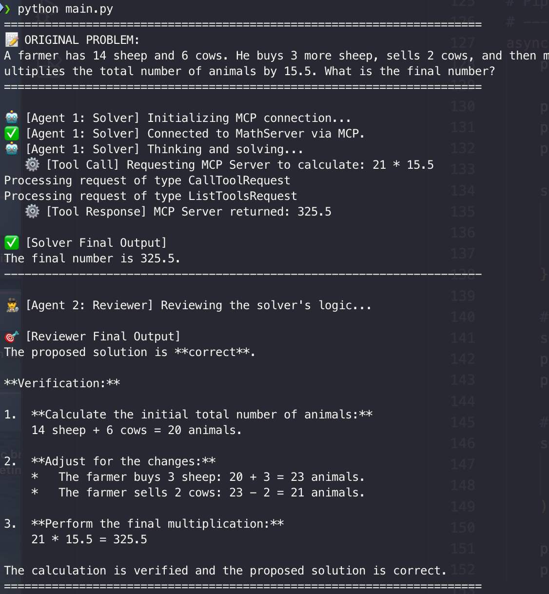

# Math Solver: Sequential Agent Practice

A practice project demonstrating the **Sequential Agent Design Pattern** combined with the **Model Context Protocol (MCP)**. This project showcases how multiple AI agents can collaborate step-by-step to solve and verify complex problems without hallucination.

## 🚀 Execution Overview



## 🧠 Architecture: How it Works

This application utilizes a two-agent sequential pipeline:

1. **Agent 1 (Math Solver):** - Acts as the initial problem solver.
   - Connected to a local `MathServer` via the **Model Context Protocol (MCP)**.
   - Instead of guessing calculations, it explicitly makes a `Tool Call` to the MCP server to evaluate mathematical expressions, ensuring 100% accuracy.
2. **Agent 2 (Math Reviewer):** - Executes strictly *after* Agent 1 finishes.
   - Takes the original problem and Agent 1's proposed solution as inputs (Shared Session State).
   - Verifies the logic step-by-step and confirms the final answer.

## 🛠️ Setup & Execution

1. **Install dependencies:**
   ```bash
   pip install google-genai python-dotenv mcp
2. **Environment Variables:**
   Create a .env file in the root directory and add your Gemini API key:
   GEMINI_API_KEY="your_api_key_here"
3. **Run the pipeline:**

